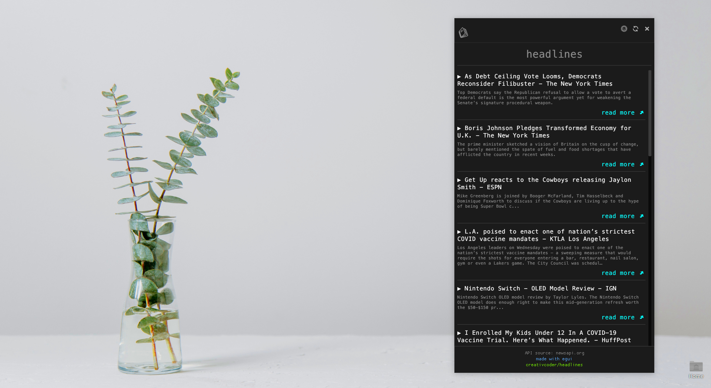

<h1>Headlines [WIP]</h1>

A cross platform native GUI app built with Rust using [egui](https://github.com/emilk/egui). Uses newsapi.org as the source to fetch news articles.

This project is intended to serve as educational content
for folks learning Rust. To follow along in the journey check out the video walkthoughs below:

## Video walkthroughs

[EP 7a](https://youtu.be/NtUkr_z7l84)

[EP 7b](https://www.youtube.com/watch?v=SvFPdgGwzTQ)

[EP 8](https://www.youtube.com/watch?v=4MKcqR9z8AU)

[EP 9](https://youtu.be/EOIhsRxhV80)

Subscribe to the [creativcoder](https://www.youtube.com/c/creativcoder?sub_confirmation=1) channel to stay updated for more.

## Implementation Status / Roadmap

- [X] Base UI
- [X] Integrate dark mode
- [X] Integrate real articles feed.
- [X] Config window for setting API_KEY
- [X] State persistance
- [X] Cross platform
- [ ] Build and release script
- [ ] CI integration using GitHub Actions
- [ ] More API features
- [ ] Multiple news sources.

## Build instructions

Before building headlines make sure `egui` [dependencies](https://github.com/emilk/egui#demo) are installed.

### Linux

On linux run `cargo run` on the terminal (you need to have the Rust toolchain installed).

### Windows

Builds on Windows as usual using `cargo run`.

### Mac

TODO

### Web

Headlines can also run locally in your browser.
Use the  `./setup_web.sh` script to install dependencies
and use `./start_web.sh` to spawn the app in the browser.

## Contributions

All kinds of contributions are welcome.

## License

MIT
